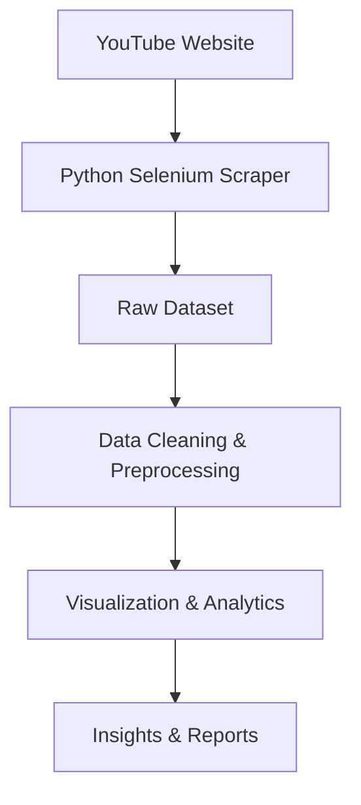

# 🚀 YouTube Scraping & Data Analysis Project

<div align="center">


### 📊 Scrape • Analyze • Visualize YouTube Data Using Python

</div>

---

## ✨ Overview

This project is a complete **YouTube data scraping and analytics pipeline** built using Python. It automates the process of collecting YouTube video data, cleaning and processing the dataset, and generating meaningful visual insights through data analysis and visualization.

The project demonstrates practical applications of:

* ✅ Web Scraping
* ✅ Browser Automation
* ✅ Data Cleaning
* ✅ Exploratory Data Analysis
* ✅ Visualization Techniques
* ✅ Python-Based Analytics Workflows It extracts video-related information from YouTube, preprocesses the collected data, and generates meaningful visual insights using data visualization techniques.

The project demonstrates:

* Web scraping using Selenium
* Data cleaning and preprocessing
* Exploratory Data Analysis (EDA)
* Text analysis
* Data visualization
* Analytical reporting

---

# 🌟 Project Features

## 🔍 Data Scraping

The scraper extracts:

* Video titles
* View counts
* Video durations
* Channel-related information
* Video metadata

from YouTube pages using Selenium automation.

---

## 🧹 Data Preprocessing

The preprocessing pipeline includes:

* Cleaning missing values
* Converting shorthand values:

  * `1K → 1000`
  * `1.5M → 1500000`
* Formatting durations
* Standardizing text
* Preparing data for visualization

---

## 📈 Data Visualization

The project generates:

* Word clouds
* Top viewed video charts
* Duration distribution analysis
* Frequency analysis
* Trend visualizations

using:

* Matplotlib
* Seaborn
* WordCloud

---

# ⚙️ Tech Stack

## 🐍 Programming Language

* Python

## 📚 Libraries Used

* Selenium
* Pandas
* NumPy
* Matplotlib
* Seaborn
* WordCloud
* Jupyter Notebook

---

# 📂 Project Structure



---

# 📂 Project Structure

```bash
Project-Youtube-Scrapping/
│
├── youtube_scraper.ipynb
├── Data_Visualization.ipynb
├── chromedriver_mac_arm64/
├── README.md
└── youtube_vedios.xlsx
```

---

# 🛠️ Installation & Setup

## Clone the Repository

```bash
git clone <your-repository-link>
```

## Navigate to the Project Directory

```bash
cd Project-Youtube-Scrapping
```
---

# ▶️ Running the Project

## Step 1: Run the Scraper

Open:

```bash
youtube_scraper.ipynb
```

Execute all cells to collect YouTube data.

---

## Step 2: Run Data Visualization

Open:

```bash
Data_Visualization.ipynb
```

Execute all cells to generate visual insights.

---

# 📊 Sample Analysis Performed

## 🔥 Top Viewed Videos

Analyze the videos with the highest engagement and views.

---

## ☁️ Word Cloud Analysis

Generate keyword-based word clouds from video titles.

---

## ⏱️ Duration Distribution

Understand content duration trends across videos.

---
# 🎯 Learning Outcomes

Through this project, the following concepts were practiced:

* Web scraping techniques
* Browser automation
* Data preprocessing
* Exploratory data analysis
* Visualization techniques
* Python project structuring

---

# 🌐 Connect With Me

* GitHub: [Vinayak Mishra](https://github.com/vinayakmishra4)
* Project Repository: [Project-Youtube-Scrapping](https://github.com/vinayakmishra4/Project-Youtube-Scrapping)

---

# 👨‍💻 Author

## Vinayak Mishra

Python Developer | Data Analytics Enthusiast | Web Scraping Projects

GitHub Repository:

[Project-Youtube-Scrapping](https://github.com/vinayakmishra4/Project-Youtube-Scrapping)

---

# 📜 License

This project is open-source and available for learning and educational purposes.

---

# 🎉 Conclusion

This project demonstrates an end-to-end workflow for collecting, processing, and analyzing YouTube data using Python. It combines scraping, preprocessing, and visualization into a single analytics pipeline and serves as a strong foundational project for data analytics and automation.
